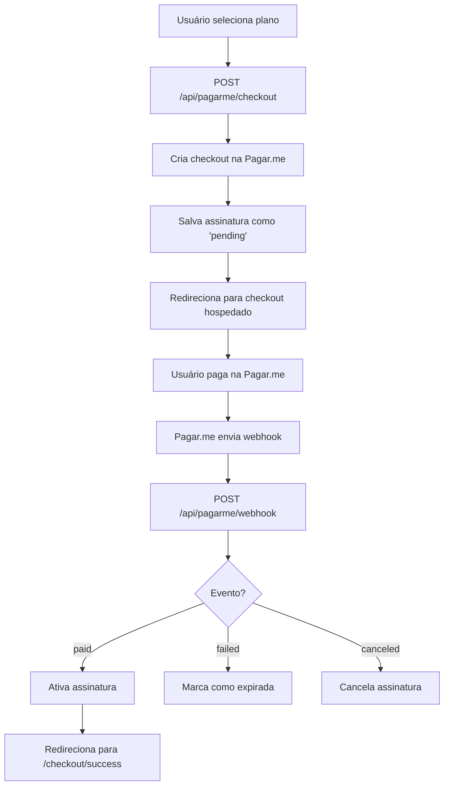

# 🚀 Guia de Implementação - Checkout Hospedado Pagar.me

## 📋 Visão Geral

Sistema de checkout completo usando a **página de pagamento hospedada da Pagar.me**. O usuário é redirecionado para uma página segura da Pagar.me para finalizar o pagamento.

---

## ✅ O QUE FOI IMPLEMENTADO

### 1. 🔧 **Endpoints de API**

#### `/api/pagarme/checkout` (POST)
- **Função**: Gera um link de checkout hospedado na Pagar.me
- **Parâmetros**: `{ plan_id, user_id }`
- **Retorno**: `{ checkout_url, checkout_id, subscription_id }`
- **Processo**:
  1. Valida autenticação do usuário
  2. Verifica se é secretária (secretárias não pagam)
  3. Verifica se já tem assinatura ativa
  4. Cria checkout na API da Pagar.me
  5. Salva assinatura no Supabase com status "pending"
  6. Retorna URL do checkout hospedado

#### `/api/pagarme/webhook` (POST)
- **Função**: Recebe notificações de status da Pagar.me
- **Eventos tratados**:
  - `order.paid` / `charge.paid` → Ativa assinatura
  - `order.payment_failed` / `charge.failed` → Marca como expirada
  - `subscription.created` → Log de criação
  - `subscription.payment_succeeded` → Atualiza pagamento recorrente
  - `subscription.canceled` → Cancela assinatura
  - `subscription.expired` → Expira assinatura

### 2. 🎨 **Páginas Front-end**

#### `/planos`
- Lista os 3 planos (Mensal, Trimestral, Anual)
- Botão "Assinar Agora" chama `/api/pagarme/checkout`
- Redireciona para checkout hospedado da Pagar.me
- Loading state durante processamento

#### `/checkout/success`
- Página de confirmação após pagamento
- Mostra mensagem de sucesso
- Links para dashboard e criar procedimento
- Loading state durante verificação

### 3. 🗄️ **Banco de Dados**

Tabelas já existentes:
- `subscriptions` → Armazena assinaturas dos anestesistas
- `payment_transactions` → Registra transações de pagamento

---

## ⚙️ CONFIGURAÇÃO NECESSÁRIA

### 1. 📝 **Criar Conta e Obter Chaves**

1. Acesse: https://pagar.me
2. Crie uma conta ou faça login
3. Acesse: Dashboard → Configurações → API
4. Copie as chaves:
   - **Test API Key** (desenvolvimento): `sk_test_...`
   - **Production API Key** (produção): `sk_...`

### 2. 🔐 **Atualizar Variáveis de Ambiente**

Edite `.env.local`:

```env
# Pagar.me
PAGARME_API_KEY=sk_028d061594634fb3af97504787f6bcb3
PAGARME_WEBHOOK_SECRET=sk_bacf426dd3a8463f8eba1498d37afb3a
NEXT_PUBLIC_PAGARME_PUBLIC_KEY=pk_EXANarahdFqDWKMQ
PAGARME_ACCOUNT_ID=acc_LBQW9n8FOSjonMlm

# Supabase (OBRIGATÓRIO)
SUPABASE_SERVICE_ROLE_KEY=SUA_SERVICE_ROLE_KEY_AQUI

# Base URL
NEXT_PUBLIC_BASE_URL=https://anesteasy.com.br
```

⚠️ **IMPORTANTE**: Você PRECISA adicionar a `SUPABASE_SERVICE_ROLE_KEY`:

**Como obter**:
1. Acesse: https://app.supabase.com
2. Selecione seu projeto
3. Vá em: Settings → API
4. Copie a **service_role** key (não a "anon" key)
5. Cole no `.env.local`

### 3. 🔗 **Configurar Webhook no Dashboard Pagar.me**

1. Acesse: https://dashboard.pagar.me
2. Vá em: Configurações → Webhooks
3. Clique em "Adicionar Webhook"
4. Configure:
   - **URL**: `https://anesteasy.com.br/api/pagarme/webhook`
   - **Eventos**:
     - ✅ `order.paid`
     - ✅ `order.payment_failed`
     - ✅ `charge.paid`
     - ✅ `charge.failed`
     - ✅ `subscription.created`
     - ✅ `subscription.payment_succeeded`
     - ✅ `subscription.canceled`
     - ✅ `subscription.expired`
5. Salve

⚠️ **Para Desenvolvimento Local**:
- Use ngrok ou similar para expor sua URL local:
  ```bash
  ngrok http 3000
  ```
- Configure o webhook com a URL do ngrok: `https://XXXXX.ngrok.io/api/pagarme/webhook`

---

## 🧪 COMO TESTAR

### 1. **Teste em Ambiente de Desenvolvimento**

```bash
# Instalar dependências
npm install

# Reiniciar servidor
npm run dev
```

### 2. **Fluxo de Teste**

1. Acesse: http://localhost:3000/planos
2. Faça login como anestesista
3. Clique em "Assinar Agora" em qualquer plano
4. Você será redirecionado para a página de checkout da Pagar.me
5. Use um **cartão de teste**:

#### 💳 **Cartões de Teste Pagar.me**

**✅ Pagamento Aprovado**:
```
Número: 4111 1111 1111 1111
Nome: TESTE APROVADO
Validade: 12/25
CVV: 123
```

**❌ Pagamento Recusado**:
```
Número: 4000 0000 0000 0010
Nome: TESTE RECUSADO
Validade: 12/25
CVV: 123
```

**📝 Dados Pessoais**:
```
CPF: 123.456.789-00
Telefone: (11) 99999-9999
Email: teste@example.com
Endereço: Rua Teste, 123 - São Paulo/SP
CEP: 01000-000
```

### 3. **Verificar Resultado**

Após o pagamento:
1. Você será redirecionado para `/checkout/success`
2. A assinatura será ativada automaticamente via webhook
3. Verifique no Supabase:
   - Tabela `subscriptions` → Status deve estar "active"
   - Tabela `payment_transactions` → Transação registrada

---

## 📊 PLANOS CONFIGURADOS

| Plano | Preço | Desconto | Economia |
|-------|-------|----------|----------|
| **Mensal** | R$ 79,00 | - | - |
| **Trimestral** | R$ 225,00 | 5% | R$ 12,00 |
| **Anual** | R$ 850,00 | 10% | R$ 98,00 |

### Características dos Planos:

**Mensal**:
- Cobrança mensal
- Cancelamento a qualquer momento
- Sem parcelamento

**Trimestral** (MAIS POPULAR):
- Cobrança trimestral (3 meses)
- Economia de R$ 12,00
- Sem parcelamento

**Anual** (MELHOR CUSTO-BENEFÍCIO):
- Cobrança anual única
- Economia de R$ 98,00
- Parcelamento em até 12x sem juros

---

## 🔄 FLUXO COMPLETO DO SISTEMA



---

## 🚨 TROUBLESHOOTING

### Problema: "supabaseKey is required"
**Solução**: Adicione `SUPABASE_SERVICE_ROLE_KEY` no `.env.local`

### Problema: Webhook não está sendo chamado
**Solução**: 
1. Verifique se configurou o webhook no dashboard Pagar.me
2. Use ngrok para desenvolvimento local
3. Verifique logs no dashboard da Pagar.me

### Problema: Assinatura não ativa após pagamento
**Solução**:
1. Verifique logs do webhook em `/api/pagarme/webhook`
2. Confirme que os eventos estão configurados no dashboard
3. Verifique se o `PAGARME_WEBHOOK_SECRET` está correto

### Problema: Erro ao criar checkout
**Solução**:
1. Verifique se a `PAGARME_API_KEY` está correta
2. Confirme que o usuário está autenticado
3. Verifique logs no console do servidor

---

## 🎯 PRÓXIMOS PASSOS

1. ✅ **Obter SUPABASE_SERVICE_ROLE_KEY** e adicionar no `.env.local`
2. ✅ **Configurar webhook** no dashboard da Pagar.me
3. ✅ **Testar fluxo completo** com cartão de teste
4. ✅ **Verificar ativação** da assinatura no Supabase
5. 🔜 **Implementar gestão de assinatura** (upgrade/downgrade/cancelamento)
6. 🔜 **Adicionar renovação automática** para planos mensais/trimestrais
7. 🔜 **Implementar notificações por email** de confirmação

---

## 📞 SUPORTE

- **Documentação Pagar.me**: https://docs.pagar.me
- **Dashboard Pagar.me**: https://dashboard.pagar.me
- **Suporte Pagar.me**: suporte@pagar.me

---

**Desenvolvido com ❤️ para AnestEasy**

